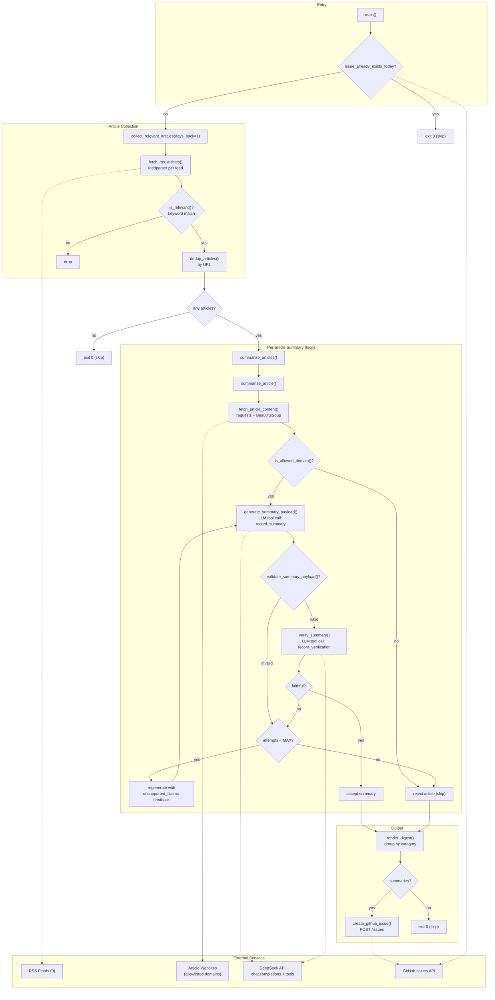
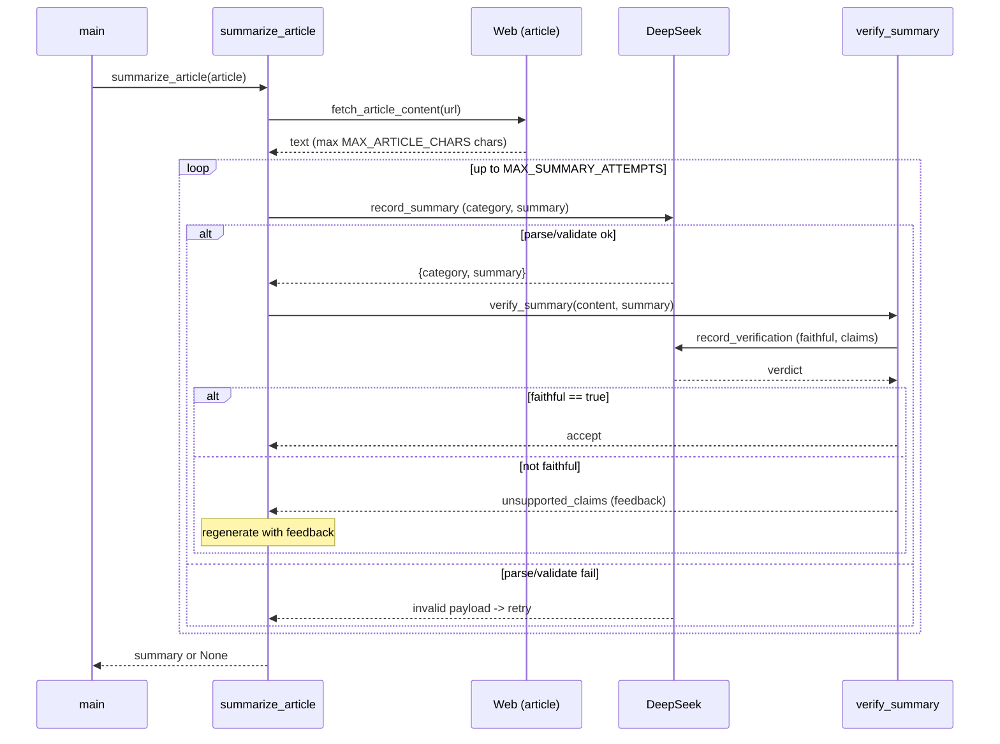

# EU AI Act News Agent — Current Architecture

This document captures the **as-is** architecture of the agent as implemented in the `news_agent` package (`config`, `collection`, `fetching`, `summarization`, `publishing`, `main`, `telemetry`).

## System overview

The agent is a **deterministic batch pipeline** (scheduled, single run) that:

1. Collects candidate articles from a fixed set of RSS feeds.
2. Filters by keyword heuristics.
3. Fetches and extracts full article text from allowlisted domains.
4. Uses an LLM (DeepSeek `deepseek-chat`) with tool calling to produce a structured,
   categorized summary per article.
5. Uses a **second, independent** LLM call ("LLM-as-judge") to fact-check each summary
   against the source text, retrying with feedback up to `MAX_SUMMARY_ATTEMPTS`.
6. Deterministically renders a Markdown digest grouped by category.
7. Publishes the digest as a GitHub Issue (idempotent per day).

The control flow is driven by **Python code**, not by the LLM. The LLM is only invoked
at two well-defined points (summarize, verify). This is a *pipeline with LLM steps*,
not an autonomous tool-using agent loop.

## Observability

Every stage in the diagram below is also an OpenTelemetry span, nested under one root
span per run (`news_agent.run`) — `telemetry.py` owns setup/shutdown, all other modules
just acquire a tracer/logger/meter the standard OTel way. Span attributes carry the
*why* behind each decision node (`RELEVANT`, `ALLOW`, `VALSUM`, `FAITHFUL`, `ATTEMPTS`,
`ANYSUM`) — rejection reasons, unsupported claims, retry counts, categories chosen — and
structured logs plus per-run metrics (articles processed by outcome, verification
attempts by result, LLM call latency) are exported alongside the traces. This is a
cross-cutting concern layered onto the pipeline below, not a new stage in the control
flow. See [`observability.md`](observability.md) for what's captured and how to view it.

## Diagram

## Sequence (single article, happy path vs. retry)

## Key components

| Component | Responsibility | Trust boundary |
|-----------|----------------|----------------|
| `fetch_rss_articles` | Parse feeds, date-filter, keyword-filter | Untrusted (RSS) |
| `is_relevant` | Keyword heuristic gate | — |
| `is_allowed_domain` | SSRF / prompt-injection mitigation | Security control |
| `fetch_article_content` | Scrape + extract main text | Untrusted (web) |
| `generate_summary_payload` | LLM summary, structured output | LLM output validated |
| `verify_summary` | LLM fact-check of summary | LLM output validated |
| `summarize_article` | Retry/feedback loop + accept/reject policy | — |
| `render_digest` | Deterministic Markdown rendering | — |
| `issue_already_exists_today` / `create_github_issue` | Idempotency + publishing | GitHub API |
| `telemetry.setup_telemetry` / `shutdown_telemetry` | OTel trace/log/metric provider lifecycle | OTLP endpoint |

## Design properties (as-is)

- **Deterministic orchestration**: Python owns all control flow; the model is called at
  fixed steps. There is no agent-driven tool selection or planning loop.
- **Structured outputs**: Both LLM calls force a single named tool (`tool_choice`), and
  every payload is validated before use.
- **Fail-closed verification**: A summary is published only if it passes the judge;
  judge-call failure is treated as "not faithful".
- **Graceful degradation**: Feed/article/LLM failures are logged and skipped; one bad
  item never aborts the run.
- **Idempotency**: One digest per day, guarded by an open-issue title check.
- **Explainable by construction**: every accept/reject decision is captured as an
  OpenTelemetry span attribute or event at the point it's made, rather than
  reconstructed after the fact — see [Observability](#observability).
